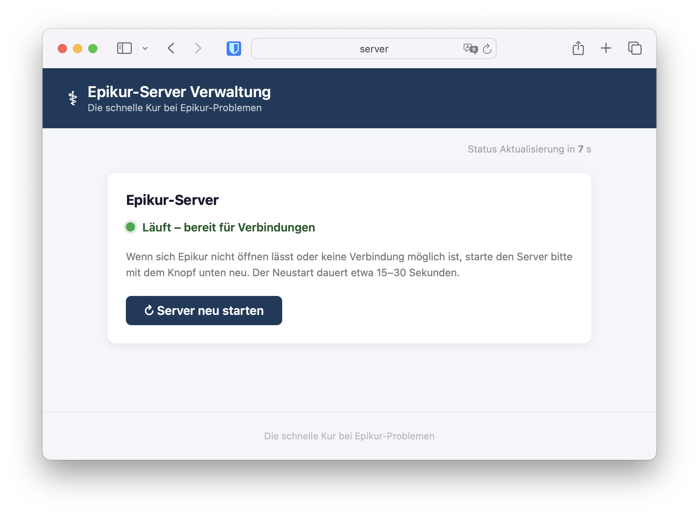

# epikur-systemd-controller



A lightweight, Flask-based web dashboard for monitoring and restarting specific
systemd services directly from a browser. It was built to solve the problem of
**Epikur** (a German practice-management software) randomly crashing on headless
Linux servers, where the normal Java-GUI restart path is unavailable. Staff in a
doctor's or psychotherapist's office can simply open a browser tab and click
**Restart** without needing SSH or remote-desktop access.

---

## Features

- **Live status** — displays `active` / `inactive` / `failed` for every
  configured service, refreshed on each page load.
- **One-click restart** — POST-only form submission prevents accidental restarts
  from bookmarks or browser pre-fetch.
- **Allowlist validation** — only services explicitly listed in
  `ALLOWED_SERVICES` can be queried or restarted; all other requests are
  rejected with HTTP 403.
- **No `shell=True`** — all `subprocess` calls use argument lists to eliminate
  shell-injection risk.
- **Configuration via `.env`** — service names are never hardcoded in the
  application logic.
- **Least-privilege sudoers** — the web process only gains the right to run
  `systemctl is-active` and `systemctl restart` for the specific services you
  configure.
- **Served by Gunicorn** — production-grade WSGI server with a systemd unit file
  included.

---

## ⚠️ Security / Disclaimer

> **Read this section carefully before deploying.**

1. **Restrict to the internal network only.** This dashboard uses HTTP Basic
   Auth over plain HTTP. Basic Auth credentials are base64-encoded, not
   encrypted — anyone who can observe the network traffic can read them. Only
   deploy on a firewalled, trusted internal network and never expose this
   dashboard to the public internet. If you need remote access, put it behind a
   reverse proxy with TLS (e.g. nginx + Let's Encrypt).

2. **Keep `ALLOWED_SERVICES` minimal.** List only the services you actually need
   to control. Every service you add increases the potential blast radius of a
   compromised dashboard.

3. **Validate the sudoers file with `visudo -c`** before activating it. A syntax
   error in `/etc/sudoers.d/` can lock you out of `sudo` entirely.

4. **Set strong, unique credentials.** Change `BASIC_AUTH_USERNAME`,
   `BASIC_AUTH_PASSWORD`, and `FLASK_SECRET_KEY` in `.env` before first start.
   The app refuses to start if any of these contain placeholder values.

This software is provided **as-is**, without warranty of any kind. The authors
are not responsible for damage caused by misconfiguration or misuse.

---

## Requirements

- Python 3.11 or newer
- A Linux system running systemd
- `sudo` configured as described below

---

## Installation & Setup

### 1. Clone the repository

```bash
git clone https://github.com/Phylu/epikur-systemd-controller.git
cd epikur-systemd-controller
```

### 2. Create a Python virtual environment and install dependencies

```bash
python3 -m venv venv
source venv/bin/activate
pip install -r requirements.txt
```

### 3. Configure the application

```bash
cp .env.example .env
# Edit .env and set ALLOWED_SERVICES to the service(s) you want to control:
#   ALLOWED_SERVICES=epikur.service
nano .env
```

### 4. Configure sudoers (least-privilege access)

The web process runs as `praxis` and needs passwordless access to two
`systemctl` sub-commands for each allowed service.

```bash
# Copy the example sudoers drop-in
sudo cp sudoers.d/epikur /etc/sudoers.d/epikur

# Edit it to match the service names in your .env
sudo nano /etc/sudoers.d/epikur

# Set the required permissions
sudo chmod 0440 /etc/sudoers.d/epikur

# Validate the syntax — do this BEFORE relying on it
sudo visudo -c -f /etc/sudoers.d/epikur
```

### 5. Deploy the application files

```bash
sudo cp -r . /home/praxis/epikur-systemd-controller/
sudo chown -R praxis:praxis /home/praxis/epikur-systemd-controller
```

### 6. Install and start the systemd services

#### Epikur Java application (`epikur.service`)

`epikur.service` starts the Epikur JAR directly via the Java binary so that
systemd can track the PID natively and capture all output in the journal.

```bash
# Install and enable the service:
sudo cp epikur.service /etc/systemd/system/
sudo systemctl daemon-reload
sudo systemctl enable --now epikur.service

# Verify it is running and follow its journal:
sudo systemctl status epikur.service
sudo journalctl -u epikur.service -f
```

#### Epikur Systemd Controller (this dashboard — `epikur-systemd-controller.service`)

```bash
sudo cp epikur-systemd-controller.service /etc/systemd/system/
sudo systemctl daemon-reload
sudo systemctl enable --now epikur-systemd-controller.service

# Verify it is running and follow its journal:
sudo systemctl status epikur-systemd-controller.service
sudo journalctl -u epikur-systemd-controller.service -f
```

Gunicorn starts as the `praxis` user and binds to `127.0.0.1:5000` by default
(localhost only). To make the dashboard reachable from other hosts on the local
network at `http://<server-ip>:5000`, override `FLASK_HOST=0.0.0.0` in your
`.env` file — and ensure port 5000 is restricted at the firewall. Do **not**
expose `0.0.0.0:5000` externally without a reverse proxy and TLS.

---

## File structure

```
epikur-systemd-controller/
├── app.py                            # Flask application
├── .env.example                      # Configuration template (copy to .env)
├── requirements.txt                  # Python dependencies
├── epikur.service                    # systemd unit for the Epikur Java application
├── epikur-systemd-controller.service # systemd unit for Gunicorn (this dashboard)
├── sudoers.d/
│   └── epikur                        # sudoers drop-in (copy to /etc/sudoers.d/)
├── .gitignore
├── LICENSE
└── README.md
```

---

## License

MIT License — see [LICENSE](LICENSE) for details.
